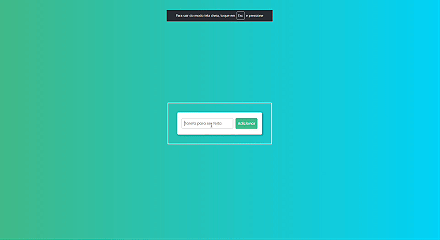

# **Lista de Tarefas (To-Do List)**

Uma aplicação simples de lista de tarefas (To-Do) construída com HTML, CSS e JavaScript puro. Permite adicionar, marcar como concluída, editar e remover tarefas. Ideal como projeto inicial para praticar DOM, armazenamento local e lógica de UI.

## Features

- Adicionar novas tarefas com título.
- Marcar/desmarcar tarefas como concluídas.
- Editar tarefas existentes.
- Remover tarefas.
- Persistência local usando LocalStorage (mantém as tarefas entre recarregamentos).

## Tech Stack

- HTML
- CSS
- JavaScript

## Como usar

- Digite o nome da tarefa no campo e pressione Enter ou clique em "Adicionar".
- Clique na tarefa para marcar como concluída.
- Clique no ícone de lápis para alterar o texto.
- Clique no ícone de lixeira/remover para apagar a tarefa.

## UX/UI

- Adicionar feedback visual ao salvar (toasts) e validação (não adicionar tarefas vazias ou tarefas já existentes).
- Layout responsível

## Deploy

- GitHub Pages

Clique [aqui](https://leopinheirosilva.github.io/lista-tarefas/) para acessar o site!

## Contato

Email: <leonardopinheirosilva16@gmail.com>

LinkedIn: <https://www.linkedin.com/in/leonardo-pinheiro-13ba26281/>
